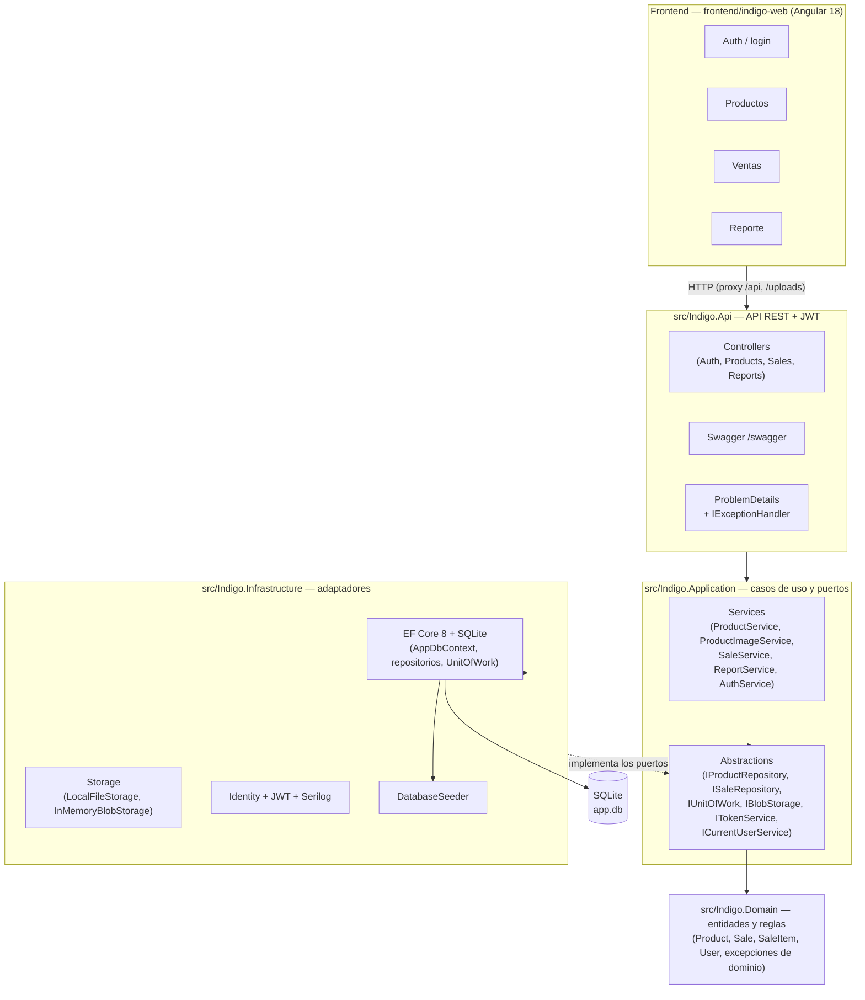

# Indigo — Sistema de Productos y Ventas

Prueba técnica end-to-end: catálogo de productos con imagen, registro de ventas con ítems, reporte por rango de fechas y autenticación con roles. Backend **.NET 8** (Clean Architecture, EF Core, SQLite, JWT) y frontend **Angular 18** (standalone + Angular Material).

Cualquier persona debe poder clonar este repositorio, levantar los dos procesos y usar el sistema completo leyendo únicamente este documento.

## Índice

1. [Descripción](#1-descripción)
2. [Arquitectura](#2-arquitectura)
3. [Stack](#3-stack)
4. [Estructura del repositorio](#4-estructura-del-repositorio)
5. [Requisitos previos](#5-requisitos-previos)
6. [Ejecución local](#6-ejecución-local)
7. [Credenciales de seed](#7-credenciales-de-seed)
8. [Endpoints de la API](#8-endpoints-de-la-api)
9. [Base de datos](#9-base-de-datos)
10. [Tests](#10-tests)
11. [Demo guiada](#11-demo-guiada)
12. [Decisiones de diseño destacadas](#12-decisiones-de-diseño-destacadas)
13. [Estado del empaquetado Docker](#13-estado-del-empaquetado-docker)
14. [Documentos del proyecto](#14-documentos-del-proyecto)

## 1. Descripción

| Requisito de la prueba | Dónde se cumple |
|---|---|
| CRUD de productos (nombre, precio, stock, categoría, imagen) | `api/products` + Angular `features/products` |
| Registro de ventas con ítems (multi-línea, descuento de stock) | `api/sales` + Angular `features/sales` |
| Reporte de ventas por rango de fechas | `api/reports/sales` + Angular `features/reports` |
| Autenticación y endpoints protegidos | Identity + JWT con roles `Admin` y `Vendedor` |
| Repo clonable en GitHub, análisis lógico, README, sustentación | este repo + `docs/` |
| Plus: testing | **232 tests** (`dotnet test`, detalle en [§10](#10-tests)) |
| Plus: paginación | uniforme en listados (ver [§8](#8-endpoints-de-la-api)) |
| Plus: logs estructurados | Serilog (consola + archivos en `logs/`) |
| Plus: mocks de Blob Storage | Adapter `IBlobStorage`: `LocalFileStorage` (real) e `InMemoryBlobStorage` (tests) |
| Plus: SOLID y patrones de diseño | ver [§12](#12-decisiones-de-diseño-destacadas) |

Reglas de negocio relevantes: baja lógica de productos (nunca se borran filas), snapshot de precio y nombre del producto en cada ítem de venta, stock insuficiente → `400`, tope de 366 días por reporte, y el `Vendedor` solo ve sus propias ventas.

## 2. Arquitectura



Reglas de dependencia: **Domain** no conoce a nadie; **Application** solo conoce a Domain y declara puertos (abstracciones); **Infrastructure** implementa los puertos; **Api** es el composition root. Verificables por las referencias de proyecto. El detalle de capas, contrato de API y decisiones está en [`docs/01-Arquitectura-de-la-Solucion.md`](docs/01-Arquitectura-de-la-Solucion.md).

## 3. Stack

| Capa | Tecnología |
|---|---|
| API | .NET 8 (C# 12, ASP.NET Core Web API) |
| Persistencia | EF Core 8 code-first sobre **SQLite** (swap a PostgreSQL preparado por configuración) |
| Auth | ASP.NET Core Identity + JWT (Bearer) con roles |
| Validación | FluentValidation → `ValidationProblemDetails` |
| Logs | Serilog (consola + rolling files en `logs/`) |
| Frontend | Angular 18.2 standalone (sin NgModules), Angular Material, signals, Reactive Forms |
| Testing | xUnit + FluentAssertions 7 + Moq + `WebApplicationFactory<Program>` |

## 4. Estructura del repositorio

```
Indigo/
├── Indigo.slnx                          # solución (formato nuevo .slnx)
├── src/
│   ├── Indigo.Domain/                   # entidades, reglas, excepciones de dominio
│   ├── Indigo.Application/              # casos de uso + puertos (abstracciones)
│   ├── Indigo.Infrastructure/           # EF Core, Identity, JWT, Storage, Seed
│   └── Indigo.Api/                      # controllers, composition root, Program.cs
├── tests/
│   ├── Indigo.Domain.Tests/
│   ├── Indigo.Application.Tests/
│   └── Indigo.Api.IntegrationTests/     # WebApplicationFactory + SQLite temporal
├── frontend/
│   └── indigo-web/                      # app Angular (tiene su propio README)
├── docs/
│   ├── 00-Analisis-Logico.md
│   ├── 01-Arquitectura-de-la-Solucion.md
│   ├── 01-Instructivo-Base-De-Datos.md
│   └── 02-Guion-de-Sustentacion.md
└── app.db                               # BD design-time (ver §9)
```

## 5. Requisitos previos

- **.NET 8 SDK** (o SDK posterior; los csproj fuerzan `net8.0`).
- **Node 18.19+ / 20 / 22** para el frontend (Angular 18).
- No se requiere instalar nada de base de datos: SQLite es un archivo y la BD se crea y migra sola al primer arranque del API.

## 6. Ejecución local

### 6.1 API (puerto 8080)

```bash
dotnet run --project src/Indigo.Api
```

- Escucha en `http://localhost:8080` (puerto fijo en `launchSettings.json`, igual en todos los entornos).
- **Swagger** en `http://localhost:8080/swagger` (probar la API con "Authorize" + token).
- `GET /` responde metadata: `{"servicio": "Indigo API", "version": "v1", "swagger": "/swagger"}`.
- Al arrancar se ejecutan automáticamente las migraciones pendientes y el seed (ver §7).

### 6.2 Frontend (puerto 4200)

```bash
cd frontend/indigo-web
npm install
npm start
```

- Abrir `http://localhost:4200` — el proxy de desarrollo (`proxy.conf.json`) enruta `/api` y `/uploads` al API en `localhost:8080`, así que **no hay CORS configurado a propósito**: en desarrollo todo es same-origin vía proxy (decisión documentada en el análisis lógico).
- El frontend tiene su propio README (`frontend/indigo-web/README.md`) con decisiones de implementación específicas.

## 7. Credenciales de seed

El seed es idempotente y se ejecuta en el primer arranque (gate `Seed:Enabled` en `appsettings.json`):

| Email | Contraseña | Rol |
|---|---|---|
| `admin@indigo.com` | `Admin123!` | Admin |
| `vendedor@indigo.com` | `Vendedor123!` | Vendedor |

También crea 12 productos de ejemplo (uno con **stock 0**, para probar el caso de error de venta). El seed **no** crea ventas: el reporte parte vacío y se llena con la demo (ver §11).

## 8. Endpoints de la API

Prefijo global `/api`. Contrato completo (códigos de estado, formatos de error, convenciones) en [`docs/01-Arquitectura-de-la-Solucion.md`](docs/01-Arquitectura-de-la-Solucion.md) §7.

### Auth

| Método | Ruta | Auth | Descripción |
|---|---|---|---|
| POST | `/api/auth/register` | — | Crea usuario con rol (201). Errores de forma en `errors` |
| POST | `/api/auth/login` | — | Devuelve `{token, expiresAt, email, roles[]}` |

### Productos

| Método | Ruta | Auth | Descripción |
|---|---|---|---|
| GET | `/api/products` | Vendedor, Admin | Paginado: `page` (1-based, default 10, máx 100), `pageSize`, búsqueda `search` (contains, case-insensitive), filtro `categoria` |
| GET | `/api/products/{id}` | Vendedor, Admin | Detalle (404 si no existe o está inactivo) |
| POST | `/api/products` | Admin | Alta (201) |
| PUT | `/api/products/{id}` | Admin | Modificación total (la imagen se cambia con su endpoint) |
| DELETE | `/api/products/{id}` | Admin | Baja lógica (204) |
| POST | `/api/products/{id}/imagen` | Admin | Multipart `imagen` → 200 `{imagenUrl}` siempre relativa (`/uploads/...`) |

### Ventas

| Método | Ruta | Auth | Descripción |
|---|---|---|---|
| GET | `/api/sales` | Vendedor, Admin | Paginado; Admin ve todas, Vendedor solo las suyas; orden fecha desc |
| GET | `/api/sales/{id}` | Vendedor, Admin | Resumen `{id, fecha, total, cantidadItems, usuarioEmail}` + snapshot de ítems (404 si es de otro vendedor) |
| POST | `/api/sales` | Vendedor, Admin | Registra venta (201); descuenta stock en transacción; 400 con `detail` si stock insuficiente |

### Reporte

| Método | Ruta | Auth | Descripción |
|---|---|---|---|
| GET | `/api/reports/sales?from=...&to=...` | Vendedor, Admin | `{desde, hasta, totalGeneral, totalVentas, totalItems, porDia[]}`. Rango inclusivo por día **UTC**, `from`/`to` obligatorias ISO-8601, tope 366 días (`from>to` → 400). Admin ve todo; Vendedor solo sus ventas |

Convenciones transversales: paginación uniforme `{items, page, pageSize, totalItems, totalPages}`; errores de forma → `ValidationProblemDetails` con `errors: {campo: [mensajes]}`, errores de negocio → `ProblemDetails` con `detail`; fechas ISO-8601 UTC; enum `categoria` como string ("Electrónica", "Hogar", "Alimentos", "Ropa", "Otros").

## 9. Base de datos

- **Code-first** con EF Core: las entidades son la fuente de verdad; la migración única es `20260919151021_InitialCreate` (12 tablas).
- Archivo SQLite y anclaje (por diseño, ver [`docs/01-Instructivo-Base-De-Datos.md`](docs/01-Instructivo-Base-De-Datos.md)):
  - **design-time** (`dotnet ef`): `<raíz del repo>/app.db` — resuelto por `AppDbContextFactory` (patrón Factory) subiendo desde el directorio de la solución.
  - **runtime** (`dotnet run`): `src/Indigo.Api/app.db` (contra el content root).
  - `ConnectionStrings__Default` (o `:Default`) tiene precedencia y unifica ambos si se desea.
- `Migrate()` + seed en cada arranque garantizan que nunca se levante contra una base vacía.
- Fechas siempre en UTC (`DateTimeOffset` guardado como TEXT).
- Para regenerar el manifest de la tool local `dotnet-ef` (versión fijada 8.0.31 en `.config/dotnet-tools.json`): `dotnet tool restore`.

## 10. Tests

```bash
dotnet test Indigo.slnx
```

**232/232 tests** en tres proyectos:

| Proyecto | Tests | Cobertura |
|---|---|---|
| `Indigo.Domain.Tests` | 58 | reglas y entidades puras |
| `Indigo.Application.Tests` | 83 | casos de uso con Moq (incluye stock insuficiente, snapshot, paginación) |
| `Indigo.Api.IntegrationTests` | 91 | HTTP end-to-end con `WebApplicationFactory<Program>` + SQLite temporal aislado por test + `InMemoryBlobStorage` |

El build compila con **0 warnings** en los 7 proyectos.

Frontend: `cd frontend/indigo-web && npm test` (Karma/Jasmine, spec smoke de arranque). La verificación funcional del frontend se hizo en runtime contra el API real (todas las pantallas) más Lighthouse 47/47. La verificación E2E automatizada (Playwright) quedó declarada fuera de alcance.

## 11. Demo guiada

Script de ~5 minutos para mostrar el sistema funcionando (detalle con tiempos en el guion de sustentación):

1. **Login Admin** (`admin@indigo.com`) → crear un producto nuevo **con imagen** (multipart; se guarda en `wwwroot/uploads/` y se sirve en `/uploads/...`).
2. **Login Vendedor** (`vendedor@indigo.com`, en otra pestaña/incógnito) → registrar una venta con 2 ítems → el **stock baja en vivo** en el listado de productos.
3. **Caso de error**: intentar vender más unidades que el stock disponible → `400` controlado con mensaje de negocio.
4. **Reporte** con rango de fechas: como Admin se ve la venta registrada; como Vendedor el reporte queda vacío (alcance server-side por rol).
5. **Swagger** en `:8080/swagger`: Authorize con el token del login y probar cualquier endpoint.

## 12. Decisiones de diseño destacadas

Resumidas de [`docs/00-Analisis-Logico.md`](docs/00-Analisis-Logico.md) §8 y [`docs/01-Arquitectura-de-la-Solucion.md`](docs/01-Arquitectura-de-la-Solucion.md) §8:

- **SOLID y patrones como objetivo explícito** — Repositorio, Unit of Work, DI, Adapter `IBlobStorage` (dos implementaciones: archivo local y en memoria), Strategy de proveedor de BD, Factory de `DbContext`.
- **Imagen en archivos locales**, no BLOB en BD: URLs limpias, migraciones livianas, swap fácil a Azure Blob Storage cambiando una implementación del adapter.
- **Snapshot de precio y nombre** en cada ítem de venta: el reporte histórico no cambia si el producto se edita o se da de baja.
- **Baja lógica (soft delete)**: los productos nunca se borran físicamente; las ventas históricas siempre resuelven su producto.
- **Roles desde el inicio** (`Admin`/`Vendedor`): visibilidad por rol también en el reporte.
- **Paginación de servidor** uniforme con búsqueda y filtro.
- **SQLite por defecto, PostgreSQL opcional**: mismo modelo relacional, swap por configuración (perfil de compose diseñado).
- **Un solo `DbContext`** con Identity: sin bases separadas para auth y negocio.
- **Reporte agregado en memoria** sobre la franja de fechas (limitación de SQLite con `decimal`), con tope de 366 días que lo mantiene acotado.

## 13. Estado del empaquetado Docker

El empaquetado Docker está **diseñado pero no escrito aún** ([`docs/01-Arquitectura-de-la-Solucion.md`](docs/01-Arquitectura-de-la-Solucion.md) §15): Dockerfile multi-stage del API, contenedor `node:20-alpine` + nginx para el frontend, volumen para SQLite, perfil opcional PostgreSQL y un único puerto publicado (`8080`). Queda como siguiente paso del roadmap; el modo de ejecución actual y verificado es el local de §6.

## 14. Documentos del proyecto

| Documento | Contenido |
|---|---|
| `docs/00-Analisis-Logico.md` | Análisis completo de la prueba: problema, alcance, RF/RNF, modelo, riesgos y cierre final (Fase 6) |
| `docs/01-Arquitectura-de-la-Solucion.md` | Arquitectura por capas, contrato de API congelado (§7), decisiones (§8), Docker (§15) y plantilla de sustentación (§17) |
| `docs/01-Instructivo-Base-De-Datos.md` | Modelo EF, migración, anclaje del archivo SQLite, colaciones, operación |
| `docs/02-Guion-de-Sustentacion.md` | Guion de 12–15 min y preguntas probables con respuesta preparada |
| `frontend/indigo-web/README.md` | README propio del frontend (build, decisiones Angular) |
