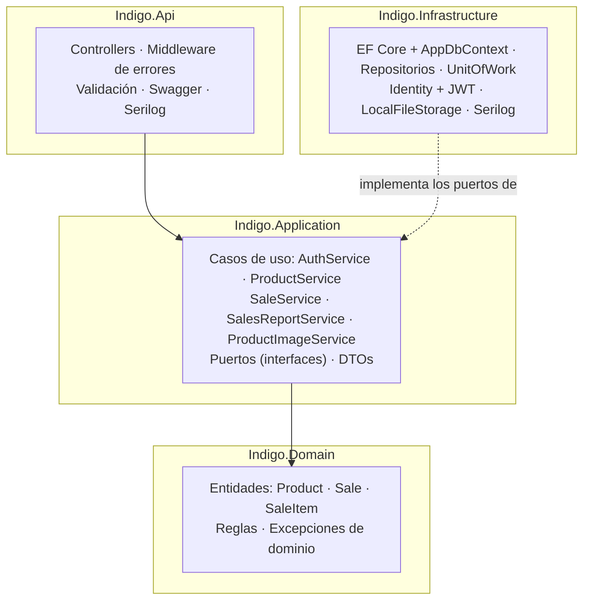
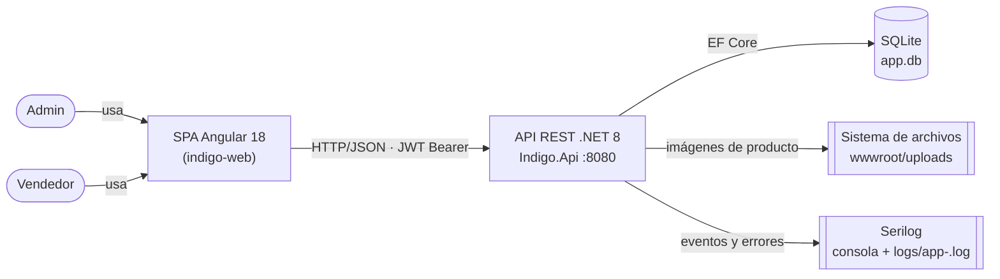

# Análisis Lógico — Sistema de Productos y Ventas

> **Estado:** final — cierre de Fase 6 aplicado (2026-09-19). El §14 registra el estado real de la implementación y las desviaciones respecto de este borrador.
>
> **Documentos relacionados:**
> - `01-Arquitectura-de-la-Solucion.md` — diseño detallado: modelo de datos, contrato de API congelado, autenticación, testing, Docker.

---

## 1. Problema y contexto

Se requiere construir un sistema **end-to-end de Productos y Ventas** que permita administrar un catálogo de productos y registrar ventas con múltiples ítems, consultando luego un reporte agregado por rango de fechas. El sistema debe autenticar usuarios con **dos roles diferenciados** (`Admin` y `Vendedor`) y aplicar las reglas de negocio propias de un flujo de venta: no vender más unidades de las disponibles en stock, dejar registro histórico de la venta aunque el producto se dé de baja, y reflejar el precio vigente al momento de la venta.

El criterio rector es que **el repositorio sea clonable y ejecutable sin configuración manual**: cualquier evaluador debe poder clonar, correr los tests y levantar el sistema completo con la menor fricción posible (por eso SQLite como base por defecto y Docker Compose como modo de ejecución de un solo comando).

Además de la funcionalidad, el proyecto tiene un **objetivo transversal explícito**: aplicar y hacer reconocibles **principios SOLID** y **patrones de diseño** (Repositorio, Unit of Work, Inyección de Dependencias, Adapter, Strategy y Factory), de modo que cada uno pueda ubicarse en el código y defenderse en la sustentación.

---

## 2. Alcance

### Incluido

- Autenticación con registro/login (JWT) y autorización por roles.
- CRUD de productos con borrado lógico (soft delete), búsqueda, filtro por categoría y paginación.
- Subida de imagen de producto (archivo en disco, nunca BLOB en base de datos).
- Registro de ventas con múltiples ítems, descuento atómico de stock y validación de disponibilidad.
- Listado y detalle de ventas con visibilidad según rol.
- Reporte de ventas agregado por día en un rango de fechas.
- Logs estructurados (Serilog) con contexto de usuario.
- Tests unitarios (dominio y aplicación) y de integración (API end-to-end).
- Empaquetado con Dockerfiles multi-stage y `docker-compose.yml`.

### Fuera de alcance

- Carrito persistente entre sesiones, lista de deseos o checkout multi-paso.
- Refresh tokens, recuperación de contraseña, confirmación de email, 2FA.
- Reportes gráficos o exportación a PDF/Excel.
- Edición de ventas ya registradas (una venta es un hecho histórico inmutable).
- Multi-tenant, multi-sucursal o multi-moneda.

---

## 3. Actores y roles

| Actor | Descripción | Permisos |
|---|---|---|
| **Admin** | Administrador del catálogo | CRUD completo de productos + subida de imagen. Ve **todas** las ventas y el reporte completo. |
| **Vendedor** | Operador de ventas | Registra ventas; ve **solo sus propias** ventas. Consulta productos (sin modificarlos). |
| **Evaluador / Operador técnico** | Quien clona y ejecuta el proyecto | Ejecuta `dotnet test`, `docker compose up --build`; consume la demo desde Swagger y la SPA. No es un rol de la aplicación: interactúa con el sistema a través de las credenciales de seed. |

Los roles se modelan con ASP.NET Core Identity y se transportan en el JWT como claims; cada endpoint declara su `[Authorize(Roles = ...)]` y la visibilidad de ventas se filtra **en el servidor** por `UsuarioId` del token, nunca por parámetro del cliente.

---

## 4. Requisitos funcionales

| ID | Requisito | Detalle / regla |
|---|---|---|
| RF-01 | Registro de usuario | `{email, password, nombreCompleto}` → 200; 400 con errores de validación si el email ya existe o la contraseña no cumple la política. |
| RF-02 | Login | `{email, password}` → `{token, expiresAt, email, roles[]}`; 400 si las credenciales son inválidas. |
| RF-03 | Listado de productos | Paginado (`page`, `pageSize`), búsqueda por nombre (contiene, case-insensitive) y filtro por categoría. Requiere autenticación. Solo productos activos. |
| RF-04 | Detalle de producto | `GET /api/products/{id}`; 404 si no existe **o** si está inactivo. |
| RF-05 | Crear producto | Solo Admin → 201 con el producto creado. |
| RF-06 | Editar producto | Solo Admin; actualización total del producto (la imagen se gestiona por endpoint aparte, no se pisa al editar). |
| RF-07 | Eliminar producto | Solo Admin → 204. **Borrado lógico** (`Activo = false`): el producto desaparece de listados y detalle, pero las ventas históricas que lo referencian siguen siendo consultables. |
| RF-08 | Imagen de producto | Solo Admin; `multipart/form-data` → `{imagenUrl}` **relativa** (`/uploads/...`). Se guarda como archivo en disco vía el puerto `IBlobStorage`. |
| RF-09 | Registrar venta | `{items: [{productoId, cantidad}]}` → 201 con la venta completa. El `UsuarioId` sale del token (nunca del body). Descuenta stock de forma transaccional; 400 si algún ítem supera el stock disponible. |
| RF-10 | Listado de ventas | Paginado; DTO de resumen `{id, fecha, total, cantidadItems, usuarioEmail}`. Admin ve todas; Vendedor solo las propias. Orden por fecha descendente. |
| RF-11 | Detalle de venta | Ítems con `{productoId, productoNombre, cantidad, precioUnitario, subtotal}` tomados del **snapshot** guardado en la venta (sobrevive a la baja del producto y a cambios posteriores de precio). |
| RF-12 | Reporte de ventas | `GET /api/reports/sales?from=YYYY-MM-DD&to=YYYY-MM-DD` → `{desde, hasta, totalGeneral, totalVentas, totalItems, porDia: [{fecha, ventas, items, total}]}`. Rango inclusivo por día UTC; solo días con ventas; `from > to` → 400; máximo 366 días. |

El contrato HTTP completo (códigos de estado, formas exactas de request/response y convenciones) está congelado en `01-Arquitectura-de-la-Solucion.md` §7 y es la fuente de verdad compartida con el frontend.

---

## 5. Requisitos no funcionales

| ID | Requisito | Cómo se satisface |
|---|---|---|
| RNF-01 | **Arquitectura limpia** | Capas `Domain ← Application ← Api` y `Infrastructure → Application`; Domain y Application sin referencias a EF Core ni ASP.NET. |
| RNF-02 | **SOLID y patrones** | Repositorio, Unit of Work, Inyección de Dependencias, Adapter (`IBlobStorage` con dos implementaciones), Strategy (proveedor SQLite/Postgres), Factory (creación del `DbContext`). Responsabilidad única visible en la separación de casos de uso (p. ej. `ProductImageService` aparte de `ProductService`). |
| RNF-03 | **Testing** | Unitarios de dominio (xUnit + FluentAssertions) y de aplicación (Moq), más integración con `WebApplicationFactory` + SQLite temporal. `dotnet test` en verde. |
| RNF-04 | **Observabilidad** | Serilog a consola y archivo rotativo diario, enriquecido con `UserId`; request logging; eventos de login (éxito/fallo, nunca la contraseña), venta registrada y excepciones no controladas con traza. |
| RNF-05 | **Ejecutable sin configuración** | SQLite como base por defecto (archivo local); migración aplicada y seed de datos al arrancar (configurable). |
| RNF-06 | **Contrato uniforme de paginación** | `{items, page, pageSize, totalItems, totalPages}`, `page` 1-based, `pageSize` por defecto 10 y máximo 100, en productos y ventas. |
| RNF-07 | **Errores consistentes** | `ProblemDetails` / `ValidationProblemDetails` con `errors: {campo: [mensajes]}`; las excepciones de dominio se mapean a 400/404; nunca se expone una excepción cruda. |
| RNF-08 | **Contrato JSON estable** | Enums serializados como string (`JsonStringEnumConverter`); fechas ISO-8601 UTC; `imagenUrl` siempre relativa. |
| RNF-09 | **Puerto único** | La API escucha en `8080` en todos los entornos (dev y Docker), para que el proxy del frontend y el compose no dependan del entorno. |
| RNF-10 | **Portabilidad de despliegue** | Dockerfiles multi-stage + `docker-compose.yml` (API + web/nginx), volumen para `app.db` y `uploads/`, healthcheck. Postgres opcional por perfil como demostración de que la persistencia no está atada a SQLite. |
| RNF-11 | **Sin secretos en el repo** | Claves JWT y cadenas de conexión fuera del control de versiones; `.gitignore` para `.env`, bases locales, logs y uploads. |
| RNF-12 | **Consistencia temporal** | Fechas en UTC (`DateTimeOffset`); el reporte agrupa por día UTC y valida `from ≤ to` antes de consultar. |

---

## 6. Modelo de dominio

| Entidad | Campos principales | Reglas de negocio |
|---|---|---|
| `Product` | `Id`, `Nombre`, `Precio`, `Stock`, `Categoria`, `Activo`, `ImagenUrl` | Nombre obligatorio; `Precio > 0`; `Stock >= 0`; categoría válida del enum `CategoriaProducto` (`Electrónica`, `Hogar`, `Alimentos`, `Ropa`, `Otros`). |
| `Sale` | `Id`, `Fecha`, `UsuarioId`, `Total`, `Items` | Al menos 1 ítem; `Total = Σ subtotales`; inmutable una vez registrada. |
| `SaleItem` | `ProductoId`, `ProductoNombre`, `PrecioUnitario`, `Cantidad`, `Subtotal` | `Cantidad > 0`; `Subtotal = PrecioUnitario × Cantidad`; `ProductoNombre` y `PrecioUnitario` son **snapshots** del momento de la venta. |

**Regla crítica:** no se puede vender más cantidad que el stock disponible; el intento lanza `ExcepcionStockInsuficiente` (derivada de `DomainException`), que la capa API traduce a un 400 con mensaje claro. La validación vive en el dominio; la infraestructura garantiza que el descuento de stock sea atómico dentro de una transacción.

---

## 7. Arquitectura de la solución

Reglas de dependencia (verificables por referencias de proyecto):

- `Api → Application` y `Api → Infrastructure` (solo para el composition root: registro de DI).
- `Infrastructure → Application` (implementa los puertos).
- `Application → Domain`.
- **Prohibido:** `Domain → Infrastructure`, `Application → Infrastructure`, y cualquier referencia a EF Core o ASP.NET en `Domain`/`Application`.

Los **puertos** (`IProductRepository`, `ISaleRepository`, `IUnitOfWork`, `IBlobStorage`, `ITokenService`, `ICurrentUserService`) viven todos en `Indigo.Application`: la capa de negocio define *qué* necesita, la infraestructura provee *cómo*. Esto es lo que permite testear los casos de uso con mocks, sin base de datos ni servidor web.

---

## 8. Decisiones de stack

| Decisión | Elección | Justificación |
|---|---|---|
| Backend | .NET 8 (C# 12), Web API | Requisito de la prueba. C# 12: primary constructors, collection expressions. |
| Arquitectura | Clean Architecture (Domain / Application / Infrastructure / Api) | Lo pedido ("Clean/Hexagonal/Onion"); las reglas de dependencia son verificables. |
| ORM | EF Core 8 | Estándar del ecosistema; migraciones y LINQ evaluables en sustentación. |
| Base de datos | SQLite (archivo local); Postgres opcional en compose | "Clonable y ejecutable": corre sin levantar servicios. El perfil Postgres demuestra el desacoplamiento vía Strategy. |
| Autenticación | ASP.NET Core Identity + JWT Bearer, roles `Admin` / `Vendedor` | Estándar reconocible; los roles permiten demostrar autorización, no solo autenticación. |
| Frontend | Angular 18 (standalone, signals, `@if/@for`, Reactive Forms) | Menor riesgo y sustentación más sólida; proxy de desarrollo hacia la API. |
| UI kit | Angular Material | Tabla + paginador + diálogos + snackbar listos. |
| Validación | FluentValidation (una sola estrategia en toda la API) | Separada del DTO; mensajes centralizados y testeables. |
| Logs | Serilog (consola + archivo) enriquecido con `UserId` | Señal de seniority con costo de implementación bajo. |
| Testing | xUnit + FluentAssertions (fijado en 7.x, licencia Apache 2.0) + Moq; `WebApplicationFactory` para integración | Pirámide de tests desde la Fase 1, no como agregado final. |
| Archivos | Puerto `IBlobStorage`: `LocalFileStorage` (disco) + `InMemoryBlobStorage` (mock) | La imagen nunca se guarda como BLOB en la BD; la abstracción es testeable. |
| Contenedores | Dockerfiles multi-stage + Docker Compose | "Clonable y ejecutable sin fricción" (Fase 5). |

---

## 9. Diagrama de contexto

En despliegue con contenedores, la SPA se sirve por **nginx**, que además actúa de proxy inverso hacia `indigo-api:8080` para `/api` y `/uploads`, de forma que el navegador ve un único origen y no hay CORS ni URLs de imagen distintas por entorno.

---

## 10. Autenticación y autorización

1. El usuario se registra o inicia sesión con email y contraseña; Identity valida credenciales y política de contraseña.
2. La API emite un **JWT** firmado que incluye identidad y **claims de rol**; la expiración es configurable en `appsettings`.
3. El frontend adjunta el token como `Authorization: Bearer` en cada llamada (interceptor); ante un `401` cierra sesión y redirige al login.
4. La autorización por rol se aplica con `[Authorize(Roles = ...)]` por endpoint; la visibilidad de ventas del `Vendedor` se resuelve en el servidor a partir del `UsuarioId` del token.
5. El registro (`/api/auth/register`) está **excluido** del interceptor de autenticación y del manejo de 401 en el frontend, para que un login fallido no provoque redirecciones en bucle.

---

## 11. Estrategia de testing

| Capa | Herramientas | Qué cubre |
|---|---|---|
| `Indigo.Domain.Tests` | xUnit + FluentAssertions | Reglas de producto (precio, stock, nombre, categoría), cálculo de subtotales y total, venta sin ítems, venta con cantidad ≤ 0, `ExcepcionStockInsuficiente`. |
| `Indigo.Application.Tests` | xUnit + Moq | Casos de uso con repositorios mockeados: paginación, alta/edición/baja de producto, flujo transaccional de la venta (commit y rollback), cálculo del reporte, generación de token. |
| `Indigo.Api.IntegrationTests` | `WebApplicationFactory<Program>` + SQLite en archivo temporal | Flujo end-to-end real: login → token → CRUD de producto → venta → verificación de stock → venta con stock insuficiente (400) → reporte con datos conocidos. |

Criterio de aceptación transversal: `dotnet test` en verde y **sin warnings relevantes** al cierre de cada fase.

---

## 12. Riesgos conocidos

| Riesgo | Mitigación |
|---|---|
| Concurrencia en el descuento de stock | Transacción + relectura del stock dentro de la transacción; SQLite serializa escrituras. Se documenta la limitación y cómo se resolvería en producción (row versioning / Postgres). |
| Errores de zona horaria en el reporte | Fechas en UTC de punta a punta; el rango se valida y se redondea a días UTC en el backend. |
| Desalineación entre contrato de API y frontend | El contrato del doc 01 §7 se congela al cerrar la Fase 3 y es fuente de verdad para la Fase 4. |
| Docker no disponible en la máquina de desarrollo | Los Dockerfiles y el compose se escriben igualmente; la verificación del compose en carpeta limpia depende de instalar Colima o Docker Desktop (decisión del usuario). |
| Alcance desbordado | Lista explícita de "fuera de alcance" (§2); los pluses se priorizan por impacto/esfuerzo en el plan de trabajo. |

---

## 13. Estado del documento

- [x] Problema y contexto
- [x] Alcance (incluido / fuera de alcance)
- [x] Actores y roles
- [x] Requisitos funcionales y no funcionales
- [x] Modelo de dominio y reglas de negocio
- [x] Arquitectura y reglas de dependencia
- [x] Decisiones de stack justificadas
- [x] Diagramas de contexto y de capas
- [x] **Cierre (Fase 6):** estado final de la implementación — qué se construyó, qué se descartó respecto de este borrador y por qué; enlaces al README y al guion de sustentación (§14).

---

## 14. Cierre de Fase 6 — estado final de la implementación (2026-09-19)

### Qué se construyó

| Fase | Resultado verificado |
|---|---|
| 0 — Análisis y plan | Contrato de API congelado (doc 01 §7); plan por fases con criterios de aceptación. |
| 1 — Esqueleto + Domain + Application | Solución `Indigo.slnx` (7 proyectos); Domain.Tests 58/58; Application.Tests 83/83; build 0 warnings. |
| 2 — BD code-first | `AppDbContext : IdentityDbContext<User>` (Strategy de proveedor + Factory de design-time), migración única `20260919151021_InitialCreate`, 12 tablas, repositorios + UnitOfWork, seed idempotente. |
| 3 — API completa | Auth, productos, ventas y reporte conformes al contrato §7; JWT con roles, ProblemDetails, Serilog, Swagger, FluentValidation; **232/232 tests** (58 + 83 + 91 de integración con `WebApplicationFactory` + SQLite temporal), build 0 warnings, smoke manual 23/23. |
| 4 — Frontend Angular 18 | Login, productos (CRUD + imagen multipart + paginado/búsqueda/filtro), ventas y reporte (fechas `dd/MM/yyyy`); re-verificado contra el Api real en runtime; Lighthouse 47/47. |
| 6 — Cierre | README, este cierre y el guion de sustentación. |

### Desviaciones respecto de este borrador

1. **Empaquetado Docker (Fase 5) no escrito.** §2 y RNF-10 preveían Dockerfiles multi-stage y `docker-compose.yml`; al cierre **esos archivos no existen** — la máquina de desarrollo no tiene Docker y la fase no se llegó a ejecutar. El diseño está completo en doc 01 §15 (servicios, volúmenes, perfil Postgres, puerto único 8080) y queda como siguiente paso explícito. Mientras tanto, el modo de ejecución documentado en el README es el local (`dotnet run` + `ng serve` con proxy).
2. **Sin endpoint `/health`.** El healthcheck diseñado en doc 01 §15 asumía `GET /health`; el Api expone `GET /` con metadata del servicio (`{servicio, version, swagger}`), que será el healthcheck del compose cuando se escriba.
3. **Frontend sin suite de specs amplia.** El testing automatizado (232 tests) vive en el backend; el frontend cuenta con 1 spec smoke (Karma/Jasmine) y se re-verificó funcionalmente contra el Api real en runtime (bloques B–E), más Lighthouse 47/47. La verificación E2E automatizada del frontend queda fuera de alcance (§16).
4. **BD dev con datos de prueba.** El Api en `src/Indigo.Api/app.db` quedó con 1 venta de prueba (id `d1b2b22f-…`, admin@indigo.com, 2 × Auriculares Bluetooth, US$ 179,98); el seed **no** crea ventas, así que un clone nuevo no la reproduce — sirve solo para la demo local.

### Lo que NO cambió respecto del borrador

- Contrato de API §7: congelado y verificado end-to-end (códigos de estado, ProblemDetails, paginación 1-based, `imagenUrl` relativa, reporte UTC con tope de 366 días).
- Decisiones de diseño: snapshot de precio, soft delete, roles, paginación de servidor, SQLite por defecto, un solo `DbContext` con Identity.
- Reglas de dependencia de capas: verificables por referencias de proyecto.

### Enlaces

- `README.md` (raíz) — ejecución, endpoints, credenciales, tests, demo.
- `docs/02-Guion-de-Sustentacion.md` — guion de 12–15 min y preguntas probables con respuesta preparada.
