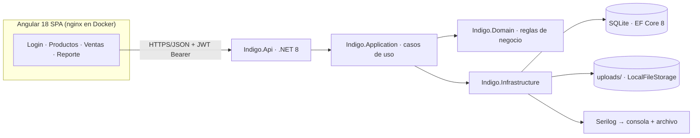
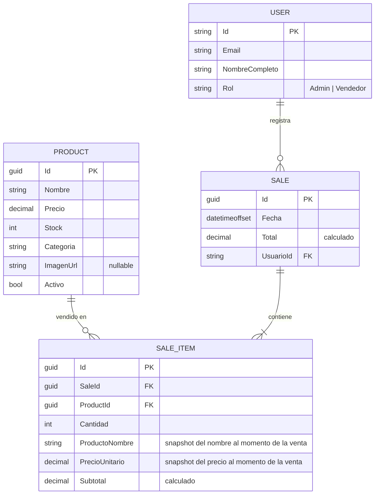
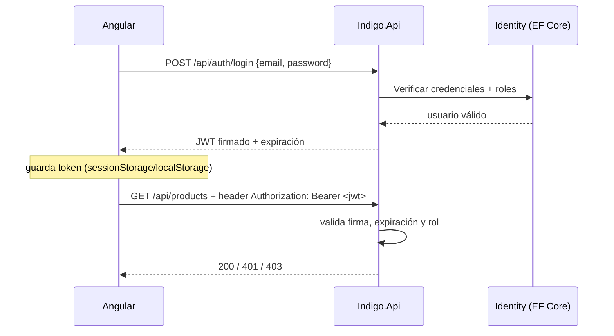

# Arquitectura de la Solución — Prueba Indigo: Sistema de Productos y Ventas

> Documento de diseño previo a la implementación. Es la fuente de verdad del contrato entre capas y con el frontend.
> Las secciones §7 (API) y §11 (paginación) **se congelan al cerrar la Fase 3** para no retrabajar la Fase 4.

---

## 1. Visión general

Sistema de **Productos y Ventas** con dos actores:

- **Admin:** gestión completa de productos (CRUD + imagen).
- **Vendedor:** registro de ventas y consulta de reportes.



**Principio rector:** el dominio no conoce EF Core, ASP.NET ni SQLite; la infraestructura se enchufa por puertos (interfaces). Esto permite reemplazar SQLite por Postgres o el blob local por Azure Blob Storage cambiando solo la capa de infraestructura y la configuración.

**Objetivo transversal del proyecto (SOLID + patrones de diseño):** aplicarlos de forma explícita y reconocible, de modo que cada uno se pueda nombrar con su ubicación en el código durante la sustentación:
- **SRP** — una razón de cambio por clase/servicio (casos de uso separados por agregado, controllers finos).
- **OCP** — los puertos están cerrados a modificación y abiertos a nuevas implementaciones (`IBlobStorage` hoy con 2, mañana con Azure Blob).
- **LSP / ISP** — puertos pequeños y cohesivos (`IProductRepository`, `IUnitOfWork`…), no interfaces god.
- **DIP** — Domain no depende de nada; Application define los contratos; Infrastructure los implementa.
- Patrones concretos: **Repository** (`IProductRepository`/`ISaleRepository`), **Unit of Work** (transacción de la venta), **Dependency Injection** (composición en Api), **Adapter** (`LocalFileStorage` / `InMemoryBlobStorage`), **Strategy** (proveedor de BD: SQLite o Postgres por configuración), **Factory** (DbContext por entorno).

---

## 2. Estructura de la solución

```
Indigo/
├── Indigo.sln
├── src/
│   ├── Indigo.Domain/                  # Entidades, enums, excepciones de dominio (sin interfaces de infraestructura)
│   ├── Indigo.Application/             # DTOs, puertos (interfaces, ver §4), casos de uso, validadores
│   ├── Indigo.Infrastructure/          # EF Core, repositorios, Identity, JWT, blob, Serilog
│   └── Indigo.Api/                     # Controllers, middlewares, DI, appsettings, seed
├── tests/
│   ├── Indigo.Domain.Tests/            # xUnit — reglas de negocio
│   ├── Indigo.Application.Tests/       # xUnit — casos de uso con mocks
│   └── Indigo.Api.IntegrationTests/    # xUnit — WebApplicationFactory + SQLite temporal
├── frontend/
│   └── indigo-web/                     # Angular 18 (standalone + signals)
├── docs/
│   └── 00-Analisis-Logico.md           # Entregable de la prueba (análisis/planteamiento)
├── docker-compose.yml                  # indigo-api + indigo-web (+ perfil postgres opcional)
└── README.md                           # Entregable de la prueba
```

**Regla de dependencias (se verifica en la sustentación):**

```
Api → Application → Domain
Api → Infrastructure → Application → Domain
```

Prohibido: `Domain → Infrastructure`, `Application → Infrastructure`, y cualquier referencia a EF Core/ASP.NET dentro de Domain o Application.

---

## 3. Capa Domain

### Entidades



### Reglas de negocio (todas con test unitario)

| Regla | Dónde se implementa |
|---|---|
| `Product.Precio > 0` y `Stock >= 0`; nombre requerido; categoría válida | Constructor/validación de `Product` |
| `Categoria` es enum (`CategoriaProducto`): `Electrónica`, `Hogar`, `Alimentos`, `Ropa`, `Otros` | Enum en Domain |
| Una venta requiere ≥ 1 ítem y cada `Cantidad > 0` | `Sale` |
| `PrecioUnitario` es **snapshot** del precio del producto al momento de vender (si mañana cambia el precio, la venta histórica no se altera) | `Sale.AgregarItem(producto, cantidad)` |
| `Subtotal = PrecioUnitario × Cantidad`; `Total = Σ Subtotal` | `SaleItem` / `Sale` |
| No se puede vender más que el stock disponible → `ExcepcionStockInsuficiente` | Caso de uso + dominio |
| El registro de venta descuenta stock **en la misma transacción** | Application + Infrastructure (UnitOfWork) |
| Reporte: ventas del rango `[from, to]` agrupadas por día → nº de ventas, ítems vendidos, total vendido | `SalesReportService` |

Excepciones de dominio propias (`DomainException` base) que la API traduce a 400/404 con mensaje claro — nunca exponer la excepción cruda.

---

## 4. Capa Application

### Puertos (interfaces que implementa Infrastructure)

```csharp
IProductRepository   // GetPaged(filtros), GetById, Add, Update, Delete
ISaleRepository      // Add (con ítems), GetById(con ítems), GetPaged
IUnitOfWork          // BeginTransaction/Commit/Rollback + SaveChanges
IBlobStorage         // GuardarAsync(stream, nombre) → url; EliminarAsync(url)
ITokenService        // GenerarToken(usuario, roles) → (token, expiración)
ICurrentUserService  // UsuarioId / roles del request actual
```

### Casos de uso (servicios de Application)

| Servicio | Operaciones |
|---|---|
| `AuthService` | Registrar usuario (rol Vendedor por defecto), Login → JWT |
| `ProductService` | Crear, actualizar, eliminar (decisión soft/hard en §8), obtener por id, listado paginado con búsqueda y filtro |
| `SaleService` | Registrar venta (valida stock → transacción → descuento → totales), obtener por id, listado paginado |
| `SalesReportService` | Reporte por rango de fechas (validar `from ≤ to`) |
| `ProductImageService` | Subir/eliminar imagen vía `IBlobStorage` y persistir URL en el producto |

DTOs en Application, mapeo manual o con un mapper simple — sin AutoMapper salvo preferencia (una prueba no lo necesita).

---

## 5. Capa Infrastructure

- **EF Core 8 + SQLite:** **un solo contexto** `AppDbContext : IdentityDbContext<User>` (configuraciones por entidad, decimales con precisión) con **una sola migración inicial** que incluye tablas de negocio y de Identity — sin dobles historiales de migración sobre la misma `app.db`. `Sale.UsuarioId` tiene FK real a `AspNetUsers.Id`. **Frontera de sesiones:** el esquema (contexto + configuraciones + migración) lo entrega BD; `User` y la lógica de Identity los escribe BACKEND.
- **Ruta de `app.db` (decisión del arquitecto 2026-09-19):** la cadena `ConnectionStrings:Default` usa `Data Source=app.db` relativo, que es relativo al directorio de trabajo del proceso — distinto en design-time y runtime. **Runtime (Api, BACKEND):** `Program.cs` resuelve la ruta relativa contra `ContentRootPath` (p. ej. `Path.Combine(builder.Environment.ContentRootPath, "app.db")`) — portable al clonar el repo; sin rutas absolutas hardcodeadas ni `workingDirectory` en `launchSettings.json`. **Design-time (BD):** `AppDbContextFactory` resuelve contra la raíz de la solución (subir hasta `Indigo.slnx`), independiente del CWD. El Api siempre ejecuta `Migrate()` + seed idempotente al arrancar, de modo que aunque design-time y runtime toquen archivos distintos, la app nunca levanta contra una BD vacía.
- **Identity:** sobre el mismo `AppDbContext` (que hereda de `IdentityDbContext<User>`): `User : IdentityUser` en Infrastructure (extensible con `NombreCompleto`), roles `Admin`/`Vendedor`, `PasswordHasher` (viene con Identity), token JWT firmado con clave configurable (`Jwt:Key`, `Jwt:Issuer`, `Jwt:Audience`, `Jwt:ExpiryMinutes` en `appsettings.json`, sobrescritos por variables de entorno para Docker).
- **`LocalFileStorage`:** escribe en `wwwroot/uploads/`, valida extensión y tamaño máximo (ej. 5 MB), devuelve URL relativa `/uploads/<nombre>` servida por el API como estático. **`InMemoryBlobStorage`:** mismo puerto, diccionario en memoria para tests.
- **Serilog:** consola + `logs/app-.log` con rolling diario; enriquecimiento con UserId desde `ICurrentUserService`; middleware de request logging (método, ruta, status, duración).
- **Seed al arrancar** (flag `Seed:Enabled`): usuarios de demo y **12 productos** con stock variado (incluye uno con stock 0 para demostrar el error controlado en la sustentación; 12 > pageSize 10 demuestra la paginación de servidor en la demo). El seeder es una clase única en Infrastructure (lógica de arranque, escrita por BACKEND) que cubre usuarios y productos.

---

## 6. Capa Api

- Controllers finos: reciben DTO, delegan al caso de uso, devuelven DTO. Sin lógica de negocio.
- Manejo global de errores: middleware que mapea `DomainException` → 400, `NotFound` → 404, resto → 500 con **ProblemDetails** (RFC 7807). Swagger en `/swagger` con esquema bearer configurado.
- Validación de entrada: **FluentValidation** (elegida sobre DataAnnotations por ser testeable y coherente con la arquitectura en capas).
- `[Authorize]` global salvo `/api/auth/*`; `[Authorize(Roles = "Admin")]` en mutaciones de productos.

---

## 7. Contrato de API (congelar al cerrar Fase 3)

Convenciones: JSON, UTC en fechas, respuestas de error ProblemDetails, paginación uniforme (§11).

### Auth (público)

| Método | Ruta | Body / Respuesta |
|---|---|---|
| POST | `/api/auth/register` | `{email, password, nombreCompleto}` → 200 / 400 |
| POST | `/api/auth/login` | `{email, password}` → `{token, expiresAt, email, roles[]}` |

### Productos

| Método | Ruta | Acceso | Notas |
|---|---|---|---|
| GET | `/api/products?page=&pageSize=&search=&categoria=` | Autenticado | Paginado; `search` busca por nombre; `categoria` filtra por enum |
| GET | `/api/products/{id}` | Autenticado | 404 si no existe |
| POST | `/api/products` | **Admin** | `{nombre, precio, stock, categoria}` → 201 con recurso |
| PUT | `/api/products/{id}` | **Admin** | Actualización **total** `{nombre, precio, stock, categoria}` (la imagen va por su endpoint) → 200 con el producto actualizado |
| DELETE | `/api/products/{id}` | **Admin** | Soft delete → 204 sin body. El listado excluye inactivos; `GET /{id}` de un inactivo → 404 |
| POST | `/api/products/{id}/imagen` | **Admin** | multipart/form-data (`file`) → 200 con `{ imagenUrl: string }` (objeto JSON, URL relativa `/uploads/...`; forma exacta aclarada 2026-09-19) |

### Ventas

| Método | Ruta | Acceso | Notas |
|---|---|---|---|
| POST | `/api/sales` | Autenticado | `{items: [{productoId, cantidad}]}` → 201 con venta completa (total calculado); 400 si stock insuficiente; guarda UsuarioId del token |
| GET | `/api/sales?page=&pageSize=` | Autenticado | Paginado. **Admin: todas · Vendedor: solo las propias** (filtro por UsuarioId del token). DTO: `{id, fecha, total, cantidadItems, usuarioEmail}` |
| GET | `/api/sales/{id}` | Autenticado | Ítems: `{productoId, productoNombre, cantidad, precioUnitario, subtotal}` — `productoNombre` es **columna snapshot real en `SaleItem`** (no join), igual que el precio: sobrevive al soft delete y a renombres del producto |

### Reporte

| Método | Ruta | Acceso | Notas |
|---|---|---|---|
| GET | `/api/reports/sales?from=YYYY-MM-DD&to=YYYY-MM-DD` | Autenticado | `{desde, hasta, totalGeneral, totalVentas, totalItems, porDia: [{fecha, ventas, items, total}]}`. `from`/`to` **inclusivos** por día (UTC); `porDia` solo días con ventas; `from > to` → 400; tope de rango 366 días. **Visibilidad por rol (aclaración 2026-09-19):** misma regla que el listado de ventas — Admin ve todo, Vendedor solo sus propias ventas (agregadas sobre el mismo filtro de datos). Coherente con §1 actores: el Vendedor consulta reportes de su propia operación |

### Convenciones de contrato (congeladas 2026-09-19)

- **Enums como string**: `JsonStringEnumConverter` en el API — `CategoriaProducto` viaja como `"Electrónica" | "Hogar" | "Alimentos" | "Ropa" | "Otros"` (URL-encoded en query string).
- **Errores de validación**: `ValidationProblemDetails` con `errors: {campo: [mensajes]}` (FluentValidation); resto de errores como `ProblemDetails` con `title`/`detail`.
- **`imagenUrl` siempre relativa** (`/uploads/...`): el API sirve `/uploads/*` estático, y **tanto el proxy de dev como nginx en Docker enrutan `/uploads` además de `/api`**.
- **`expiresAt`** en ISO-8601 UTC; el frontend **delega la expiración al manejo del 401** (sin cierre programado de sesión).
- **Búsqueda de productos**: `search` es contains case-insensitive sobre nombre; `categoria` filtra por nombre de enum.
- **Contraseñas**: política default de Identity (≥6, mayúscula, minúscula, dígito, no alfanumérico); los seeds `Admin123!` / `Vendedor123!` la cumplen.
- **PUT de producto**: actualización total sin tocar imagen (la imagen va por `POST /{id}/imagen`); devuelve el producto actualizado.

---

## 8. Decisiones de diseño destacadas (para defender en la sustentación)

1. **Imagen = archivo en disco + URL en BD, nunca BLOB.** BLOBs degradan consultas y backups. El puerto `IBlobStorage` deja el camino listo a Azure Blob/S3.
2. **Snapshot de precio en `SaleItem`.** La venta refleja el precio del momento; sin snapshot, un cambio de precio reescribiría la historia.
3. **Delete de producto: soft delete** (`Activo = false`) para no romper el histórico de ventas (FK hacia productos). El listado muestra solo activos; el reporte histórico sigue intacto. Si la prueba exige borrado físico visible, se explica esta decisión en la sustentación — es un punto a favor, no en contra.
4. **Roles desde el inicio.** "Autenticación y endpoints protegidos" se cumple con login + JWT; los roles demuestran además **autorización** fina (Admin vs Vendedor).
5. **Paginación de servidor**, no cliente: el contrato (§11) escala a miles de registros sin traer todo a memoria.
6. **SQLite por defecto + Postgres opcional** vía perfil de compose: la entrega corre sin fricción, y el cambio de provider es solo configuración + migración — demuestra que la arquitectura no está atada a la BD.
7. **Visibilidad de ventas por rol**: Admin ve todas las ventas, Vendedor solo las propias — demuestra autorización fina más allá de "está autenticado".
8. **SOLID y patrones de diseño como objetivo explícito** (pedido del candidato): SRP/OCP/LSP/ISP/DIP aplicados por capa y patrones concretos — Repository, Unit of Work, DI, Adapter (`IBlobStorage`), Strategy (proveedor de BD) — cada uno ubicable en el código y defendible en la sustentación. Ver §1.
9. **Un solo `DbContext` con Identity integrado.** `AppDbContext : IdentityDbContext<User>`: una sola migración inicial (negocio + tablas de Identity), FK real `Sale.UsuarioId → AspNetUsers.Id`, sin dobles historiales de migración sobre la misma `app.db`. La alternativa (dos contextos con `--context`) fragiliza el orden de aplicación de migraciones — decisión defendible en sustentación.
10. **Agregación del reporte en memoria por limitación del proveedor SQLite.** SQLite mapea `decimal` a TEXT: `SUM`/`ORDER BY` nativos sobre decimales no aplican. `SalesReportService` agrega en C# sobre las filas del rango (volúmenes de prueba irrelevantes); la configuración `decimal(18,2)` se mantiene porque en el perfil Postgres la agregación sí sería SQL nativa. Conocer la diferencia entre providers es punto a favor en la sustentación.

---

## 9. Flujo de autenticación



- Sin refresh tokens (fuera de alcance, ver §16) — mencionar en la sustentación como evolución natural.
- El interceptor de Angular agrega el header y ante 401 limpia el token y redirige a login.

---

## 10. Frontend Angular (estructura objetivo)

```
frontend/indigo-web/src/app/
├── core/
│   ├── auth/          # auth.service, auth.interceptor, auth.guard, role.guard, token storage
│   ├── models/        # interfaces espejo de los DTOs del API
│   └── config/        # environment (apiUrl), url de proxy en desarrollo
├── features/
│   ├── auth/          # login (+ registro opcional)
│   ├── products/      # lista (tabla + paginator + búsqueda) · formulario · subida de imagen
│   ├── sales/         # crear venta (carrito) · lista de ventas · detalle
│   └── reports/       # selector de fechas + tabla resumen por día + totales
└── shared/            # confirm-dialog, empty-state, page-title, validadores
```

Convenciones: standalone components, signals para estado local, `@if/@for` (control flow nuevo), Reactive Forms + validadores, HttpClient con interceptor, guards de ruta por autenticación y rol, Angular Material (MatTable + MatPaginator + MatDialog + MatSnackBar). Sin NgModules nuevos.

Rutas: `/login` → `/productos` (todos) → `/ventas/nueva`, `/ventas` → `/reportes`. Barra de navegación con rol visible y logout.

---

## 11. Contrato de paginación (uniforme en todo el API)

```json
{
  "items": [],
  "page": 1,
  "pageSize": 10,
  "totalItems": 47,
  "totalPages": 5
}
```

- Parámetros: `page` (1-based) y `pageSize` (default 10, máx 100); valores inválidos → 400.
- El orden por defecto: productos por nombre; ventas por fecha descendente.
- Frontend: `MatPaginator` con `totalItems` del servidor; cada cambio de página/filtro re-consulta la API.

---

## 12. Manejo de archivos (blob mock)

```mermaid
graph TD
    UI[Subida de imagen] --> API[POST /api/products/{id}/imagen]
    API --> SVC[ProductImageService]
    SVC --> BLOB[IBlobStorage]
    BLOB -->|producción| LOCAL[LocalFileStorage → wwwroot/uploads]
    BLOB -->|tests| MEM[InMemoryBlobStorage]
```

- Validación en Application: extensión (jpg/png/webp), tamaño ≤ 5 MB, nombre generado (GUID + extensión) para evitar colisiones y path traversal.
- Reemplazar la imagen elimina la anterior. Eliminar el producto elimina su archivo.
- El API sirve `/uploads/*` como estático (en Docker, volumen persistente).

---

## 13. Logs estructurados (Serilog)

- **Consola** (para Docker, sin contenedores de logs adicionales) + **archivo** con rolling diario.
- Eventos mínimos: request logging (método/ruta/status/duración), login fallido/exitoso (sin password), venta registrada (`SaleId`, `UsuarioId`, `Total`), excepciones no controladas con trace.
- Enriquecimiento: `UserId` del token cuando existe. Demo de sustentación: registrar una venta y mostrar el log.

---

## 14. Estrategia de testing

| Proyecto | Alcance | Herramientas |
|---|---|---|
| `Domain.Tests` | Reglas puras: validaciones de producto, subtotales/total, stock insuficiente, snapshot de precio | xUnit + FluentAssertions |
| `Application.Tests` | Casos de uso con puertos mockeados: alta/edición de producto, venta completa, errores de dominio | Moq |
| `Api.IntegrationTests` | `WebApplicationFactory<Program>` con SQLite temporal y `InMemoryBlobStorage`: login real → token → CRUD completo, venta con descuento de stock, 400 por stock, reporte con datos conocidos, 401 sin token, 403 con rol Vendedor en POST producto | xUnit + `Microsoft.AspNetCore.Mvc.Testing` |

Objetivo: cobertura de las **reglas y flujos que la prueba evalúa**, no cobertura porcentual vacía. El flujo de la venta (el más delicado por la transacción) tiene test unitario **y** de integración.

Concurrencia: documentar que SQLite serializa escrituras; en Postgres la mitigación sería transacción + bloqueo optimista (`xmin`/version row). Es pregunta probable de sustentación.

---

## 15. Docker

```yaml
services:
  indigo-api:  # build: Dockerfile multi-stage (.NET sdk → aspnet)
               # ports: 8080:8080 · volumes: data:/app/data (app.db), uploads:/app/wwwroot/uploads
               # healthcheck: GET /health
  indigo-web:  # build: node:20-alpine (ng build) → nginx:alpine
               # ports: 80:80 · nginx proxypass /api y /uploads → indigo-api:8080
  # perfil opcional:
  indigo-db:   # postgres:16 (solo con --profile postgres), connection string por variable de entorno
```

- SQLite en volumen: los datos sobreviven a `docker compose down/up` (punto visible en la demo).
- El frontend se compila una vez dentro de la imagen (nginx sirve estáticos): la entrega no requiere Node en la máquina del evaluador.
- **Puerto único `8080` en todos los entornos:** el `launchSettings.json` de desarrollo fija `http://localhost:8080` (mismo puerto que el contenedor), de modo que el `proxy.conf.json` del frontend apunta siempre a `localhost:8080` — dev y Docker sin dobles configuraciones. Decisión del arquitecto 2026-09-19.

---

## 16. Fuera de alcance (explicitar en el README/análisis)

- Refresh tokens / logout server-side.
- Carrito persistente entre sesiones.
- Gráficos avanzados en el reporte (tabla + totales cumplen; un gráfico simple es opcional si sobra tiempo).
- Multi-tenancy, auditoría completa, colas/mensajería.

---

## 17. Sustentación — guion propuesto (12–15 min)

1. **Arranque** (2 min): `docker compose up --build` → app en `http://localhost`. Impacto inmediato.
2. **Demo funcional** (5 min): login como Admin → crear producto con imagen → login como Vendedor → registrar venta (se ve el stock bajar) → intento de venta sin stock (error controlado) → reporte por rango de fechas → Swagger.
3. **Arquitectura** (3 min): diagrama de capas, regla de dependencias, por qué puertos y adaptadores (Clean Architecture) y no un monolito de capas anémico.
4. **Calidad** (2 min): `dotnet test` en vivo, logs de Serilog mostrando la venta recién registrada, paginación.
5. **Decisiones difíciles** (2 min): snapshot de precio, soft delete vs histórico, SQLite vs Postgres, BLOB vs archivo en disco.

### Preguntas probables (con respuesta preparada)

| Pregunta | Respuesta clave |
|---|---|
| ¿Por qué Clean Architecture para un proyecto tan chico? | La prueba lo pide, y además: la frontera Domain/Infra permite probar reglas sin BD, cambiar SQLite→Postgres sin tocar negocio, y muestra que el diseño manda sobre la tecnología. |
| ¿Por qué SQLite y no SQL Server/Postgres? | La entrega exige "clonable y ejecutable"; SQLite corre sin servicios. El perfil Postgres de compose demuestra que el cambio es configuración, no arquitectura. |
| ¿Cómo manejarías ventas concurrentes sobre el mismo producto? | Transacción + relectura de stock; en Postgres, además, version row/bloqueo optimista. En SQLite la escritura es serializada por diseño. |
| ¿Por qué snapshot de precio? | Integridad histórica: la venta es un hecho contable del momento en que ocurrió. |
| ¿Qué pasa si borro un producto vendido? | Soft delete: el histórico de ventas nunca se rompe. |
| ¿Cómo escalarías? | Stateless API → múltiples instancias; BD real (Postgres) fuera del contenedor; blob a S3/Azure; frontend en CDN; observabilidad (los logs ya son estructurados). |
| ¿Seguridad del JWT? | Clave en configuración/variables de entorno (no en el repo), expiración corta, claims de rol, HTTPS en producción. |
| ¿Por qué no guardaste la imagen como BLOB? | Rendimiento de consultas/backups; archivo en disco + URL es el patrón estándar, y el puerto de blob abstrae el destino. |

---

*Este documento es la fuente de verdad del diseño. Si durante la implementación surge un cambio de contrato (endpoint, DTO, regla), actualizar primero aquí y luego el código — así la sustentación se prepara sola.*
